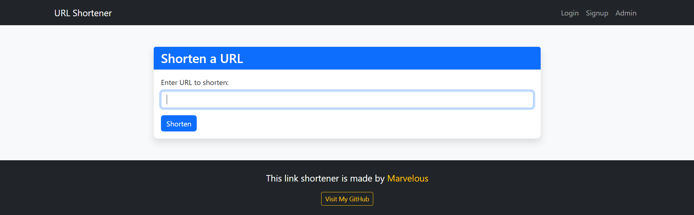
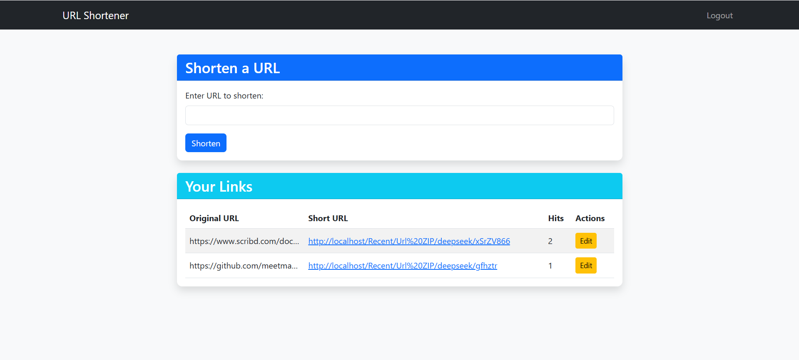
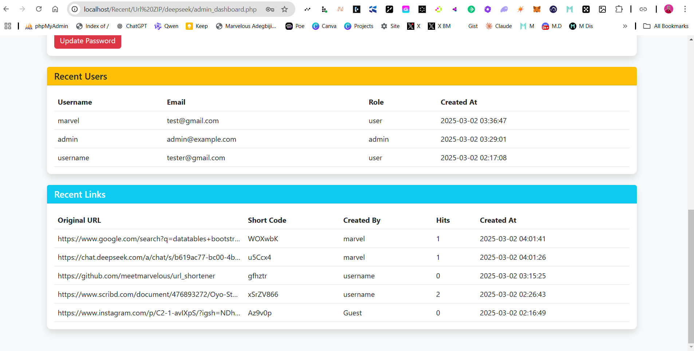

**URL Shortener**  
A simple and powerful URL shortener application built with **PHP**, **MySQL**, and **Bootstrap**. This project allows users to shorten long URLs, manage their links, and track hits. It also includes an **admin dashboard** for managing users and links.

---

### **Features**  
- **Shorten URLs**: Create short URLs for any valid long URL.  
- **User Authentication**: Register, login, and manage your links.  
- **Guest Links**: Links created without logging in are saved and transferred to your account upon registration or login.  
- **Dashboard**: View and manage all your shortened links in a beautiful, responsive table.  
- **Admin Dashboard**: Admins can view all users and links, and manage the system.  
- **Hits Tracking**: Track how many times each short URL has been accessed.  
- **Responsive Design**: Works seamlessly on all devices.  

---

### **File Structure**  
```
/url-shortener/
│
├── /assets/                  # Static files (CSS, JS, images)
│   ├── css/
│   │   └── styles.css        # Custom CSS for styling
│   └── js/
│       └── scripts.js        # Custom JavaScript for interactivity
│
├── /includes/                # PHP includes (database connection, functions, etc.)
│   ├── db.php                # Database connection
│   ├── auth.php              # Authentication functions
│   ├── functions.php         # Helper functions
│   └── admin_functions.php   # Admin-specific functions
│
├── /process/                 # Form processing scripts
│   ├── login_process.php     # Handle login
│   ├── signup_process.php    # Handle signup
│   ├── shorten_process.php   # Handle URL shortening
│   └── edit_process.php      # Handle URL editing
│
├── index.php                 # Homepage (shorten links and view dashboard)
├── login.php                 # Login page
├── signup.php                # Signup page
├── admin_dashboard.php       # Admin dashboard
├── edit.php                  # Edit short URLs
├── logout.php                # Logout script
├── .htaccess                 # URL rewriting rules
├── config.php                # Application configuration
├── README.md                 # Project documentation
└── LICENSE                   # MIT License
```

---

### **Installation**  

#### **Prerequisites**  
- **PHP** (>= 7.4)  
- **MySQL** (>= 5.7)  
- **Web Server** (Apache, Nginx, etc.)  

#### **Steps**  
1. **Clone the Repository**:  
   ```bash
   git clone https://github.com/meetmarvelous/url-shortener.git
   cd url-shortener
   ```

2. **Set Up the Database**:  
   - Create a new MySQL database (e.g., `url_shortener`).  
   - Import the SQL schema from `database.sql`:  
     ```bash
     mysql -u your_username -p url_shortener < database.sql
     ```

3. **Configure the Application**:  
   - Open `config.php` and update the database credentials:  
     ```php
     define('DB_HOST', 'localhost');
     define('DB_USER', 'your_username');
     define('DB_PASS', 'your_password');
     define('DB_NAME', 'url_shortener');
     define('BASE_URL', 'https://yourdomain.com/');
     ```

4. **Set Up the Web Server**:  
   - Point your web server to the `url-shortener` directory.  
   - Ensure `.htaccess` is enabled for URL rewriting.  

5. **Access the Application**:  
   - Open your browser and navigate to `http://localhost/url-shortener`.  

---

### **Usage**  

#### **For Users**  
1. **Shorten a URL**:  
   - Visit the homepage (`index.php`).  
   - Enter a long URL and click **Shorten**.  
   - Copy the generated short URL.  

2. **Manage Links**:  
   - Log in to view your dashboard.  
   - Edit or delete your links.  

3. **Track Hits**:  
   - View the number of times each short URL has been accessed.  

#### **For Admins**  
1. **Admin Dashboard**:  
   - Log in as an admin (default credentials: `admin` / `admin`).  
   - View all users and links.  
   - Manage the system.  

---

### **Screenshots**  
- **Homepage**:   
- **Dashboard**:   
- **Admin Dashboard**:   

---

### **License**  
This project is licensed under the **MIT License**. See the [LICENSE](LICENSE) file for details.  

---

### **Contributing**  
Contributions are welcome! Please follow these steps:  
1. Fork the repository.  
2. Create a new branch (`git checkout -b feature/YourFeature`).  
3. Commit your changes (`git commit -m 'Add some feature'`).  
4. Push to the branch (`git push origin feature/YourFeature`).  
5. Open a pull request.  

---

### **Author**  
- **Marvelous Meet**  
  GitHub: [meetmarvelous](https://github.com/meetmarvelous)  
  Portfolio: [meetmarvelous](https://marvelbyte.vercel.app)  

---

### **Acknowledgments**  
- **Bootstrap** for the responsive design.  
- **DataTables** for the interactive tables.  
- **PHP** and **MySQL** for the backend functionality.  

---

### **Support**  
If you encounter any issues or have questions, please open an issue on [GitHub](https://github.com/meetmarvelous/url-shortener/issues).  

---

Enjoy using the URL Shortener! 🚀